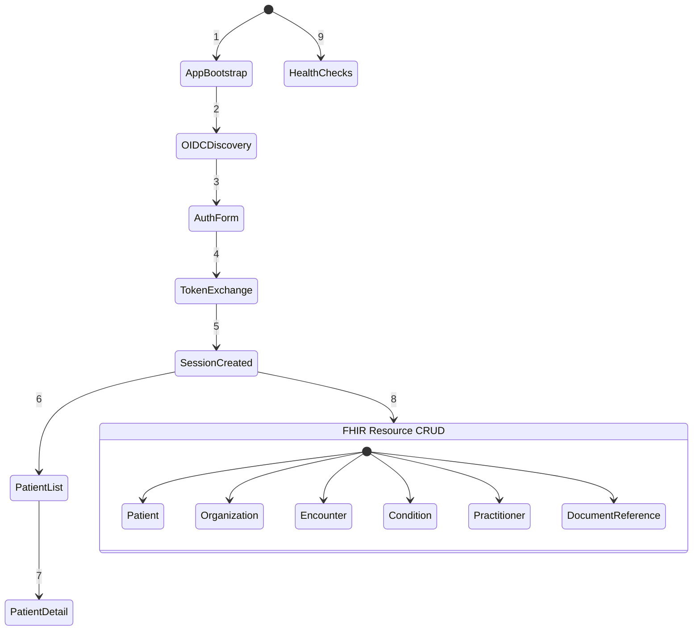
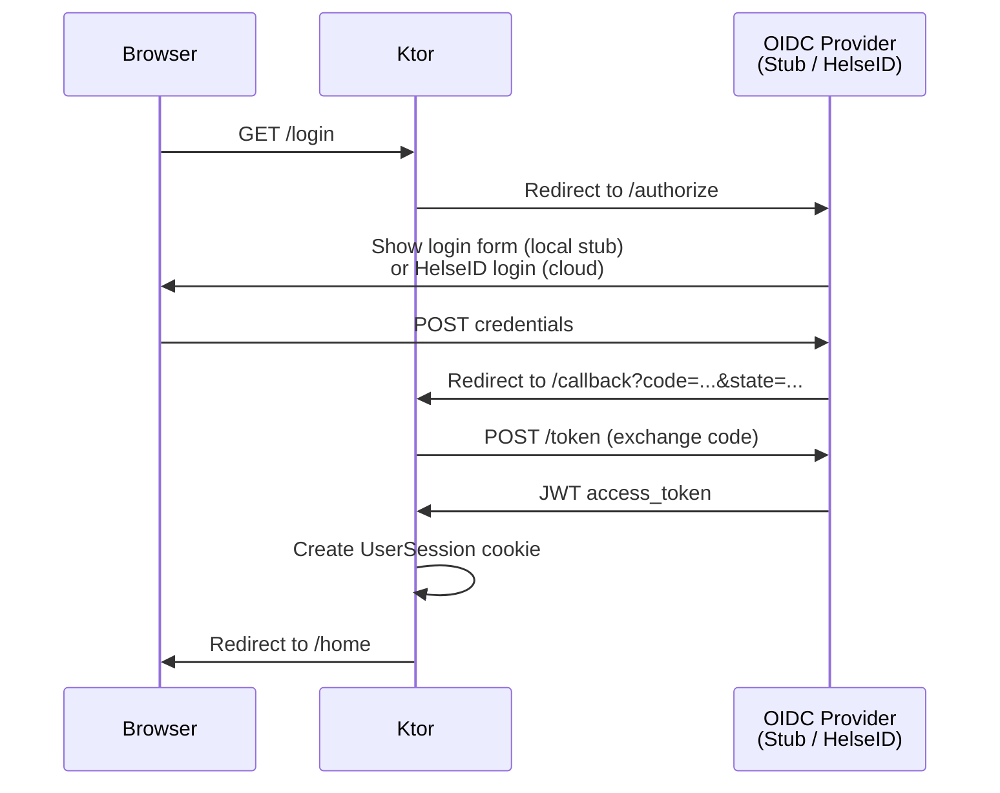
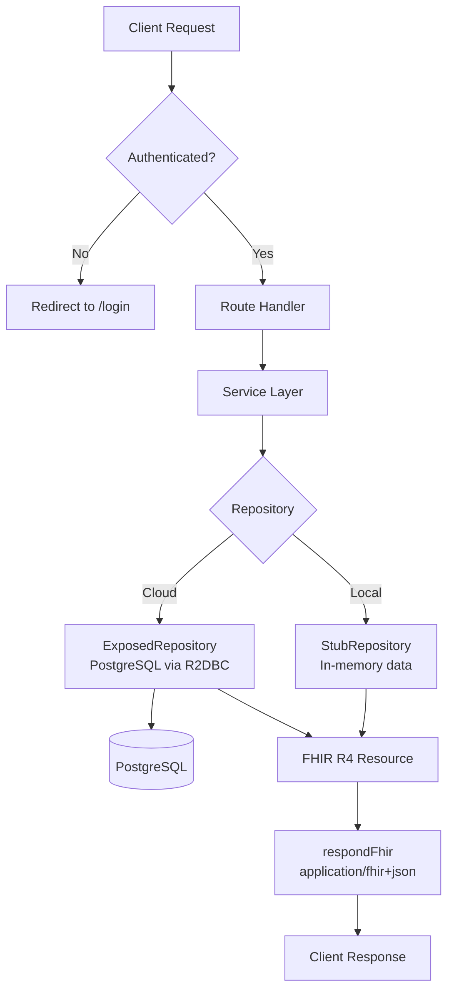

# State Machine Reference

This document defines the application's state flows and maps every source file to the flow it belongs to. **AI agents and developers must reference this before making changes** to ensure compatibility with existing state management.

## Developer Workflow

1. **Before coding**: Identify which numbered flow your change affects
2. **During implementation**: Ensure transitions match documented flows
3. **After completion**: Update diagrams if you add/modify states or transitions

---

## Table of Contents

1. [Application State Flow](#application-state-flow)
2. [Authentication Flow](#authentication-flow)
3. [Numbered Flow Descriptions & Affected Files](#numbered-flow-descriptions--affected-files)
4. [FHIR API Request Lifecycle](#fhir-api-request-lifecycle)
5. [Cross-Cutting Concerns](#cross-cutting-concerns)
6. [Database Table Reference](#database-table-reference)
7. [Source File Inventory](#source-file-inventory)

---

## Application State Flow

---

## Authentication Flow

**Environments:**
- **Local**: Built-in OIDC stub at `/oidc/*` (RSA-signed JWTs, in-memory auth codes)
- **Cloud**: HelseID OAuth 2.1 (external OIDC provider)

---

## Numbered Flow Descriptions & Affected Files

### 1. App Bootstrap

Application entry point — wires plugins, serialization, sessions, security, and FHIR routing.

**Files:**
- `src/main/kotlin/Application.kt`
- `src/main/kotlin/plugins/Serialization.kt`
- `src/main/kotlin/plugins/Session.kt`
- `src/main/resources/application.yaml`
- `src/main/resources/application-local.yaml`
- `src/main/resources/logback.xml`

### 2. OIDC Discovery & Auth Redirect

User navigates to `/login`. Ktor's OAuth plugin redirects to the OIDC provider's authorize endpoint.

**Files:**
- `src/main/kotlin/Routing.kt` (GET /login)
- `src/main/kotlin/auth/Security.kt` (OAuth provider config)

### 3. Authorization Form (Local Stub)

Local stub presents a login form. In cloud, HelseID handles this externally.

**Files:**
- `src/main/kotlin/auth/stub/Oidc.kt` (GET /oidc/authorize, POST /oidc/authorize)

### 4. Token Exchange

Ktor exchanges the authorization code for a JWT access token.

**Files:**
- `src/main/kotlin/auth/stub/Oidc.kt` (POST /oidc/token, GET /oidc/jwks, GET /oidc/.well-known/openid-configuration)
- `src/main/kotlin/Routing.kt` (GET /callback)

### 5. Session Created → Home

After successful auth, a `UserSession` cookie is set and the user is redirected to `/home`.

**Files:**
- `src/main/kotlin/Routing.kt` (GET /callback, GET /home)
- `src/main/kotlin/plugins/Session.kt`
- `src/main/kotlin/auth/Security.kt`
- `src/main/kotlin/auth/UserInfo.kt`

### 6. Patient List (Frontend)

Index page fetches all patients from `/fhir/Patient` and displays them as links.

**Files:**
- `frontend/src/routes/index.tsx`
- `frontend/src/routes/__root.tsx`
- `frontend/src/utils/mapping/fhir.ts`

### 7. Patient Detail (Frontend)

Patient detail page fetches a single patient by ID.

**Files:**
- `frontend/src/routes/patient/$patientId/index.tsx`
- `frontend/src/utils/mapping/fhir.ts`

### 8. FHIR Resource CRUD

All FHIR resources follow the same pattern: GET collection, GET by ID, POST create. Each checks authentication via session cookie.

#### 8a. Patient

**Files:**
- `src/main/kotlin/fhir/patient/PatientRouting.kt`
- `src/main/kotlin/fhir/patient/PatientService.kt`
- `src/main/kotlin/fhir/patient/repository/PatientRepository.kt`
- `src/main/kotlin/fhir/patient/repository/PatientTable.kt`
- `src/main/kotlin/fhir/patient/repository/StubPatientRepository.kt`

#### 8b. Organization

**Files:**
- `src/main/kotlin/fhir/organization/OrganizationRouting.kt`
- `src/main/kotlin/fhir/organization/OrganizationService.kt`
- `src/main/kotlin/fhir/organization/repository/OrganizationRepository.kt`
- `src/main/kotlin/fhir/organization/repository/OrganizationTable.kt`
- `src/main/kotlin/fhir/organization/repository/StubOrganizationRepository.kt`

#### 8c. Encounter

**Files:**
- `src/main/kotlin/fhir/encounter/EncounterRouting.kt`
- `src/main/kotlin/fhir/encounter/EncounterService.kt`
- `src/main/kotlin/fhir/encounter/repository/EncounterRepository.kt`
- `src/main/kotlin/fhir/encounter/repository/EncounterTable.kt`
- `src/main/kotlin/fhir/encounter/repository/StubEncounterRepository.kt`

#### 8d. Condition

**Files:**
- `src/main/kotlin/fhir/condition/ConditionRouting.kt`
- `src/main/kotlin/fhir/condition/ConditionService.kt`
- `src/main/kotlin/fhir/condition/repository/ConditionRepository.kt`
- `src/main/kotlin/fhir/condition/repository/ConditionTable.kt`
- `src/main/kotlin/fhir/condition/repository/StubConditionRepository.kt`

#### 8e. Practitioner

**Files:**
- `src/main/kotlin/fhir/practitioner/PractitionerRouting.kt`
- `src/main/kotlin/fhir/practitioner/PractitionerService.kt`
- `src/main/kotlin/fhir/practitioner/repository/PractitionerRepository.kt`
- `src/main/kotlin/fhir/practitioner/repository/PractitionerTable.kt`
- `src/main/kotlin/fhir/practitioner/repository/StubPractitionerRepository.kt`

#### 8f. DocumentReference

**Files:**
- `src/main/kotlin/fhir/documentreference/DocumentReferenceRouting.kt`
- `src/main/kotlin/fhir/documentreference/DocumentReferenceService.kt`
- `src/main/kotlin/fhir/documentreference/repository/DocumentReferenceRepository.kt`
- `src/main/kotlin/fhir/documentreference/repository/DocumentReferenceTable.kt`
- `src/main/kotlin/fhir/documentreference/repository/StubDocumentReferenceRepository.kt`

### 9. Health Checks

Kubernetes liveness and readiness probes.

**Files:**
- `src/main/kotlin/Routing.kt` (GET /internal/health/alive, GET /internal/health/ready)

---

## FHIR API Request Lifecycle

---

## Cross-Cutting Concerns

These files are used across multiple flows:

| Layer | Files |
|-------|-------|
| **Auth** | `auth/Security.kt`, `auth/UserInfo.kt`, `plugins/Session.kt` |
| **Auth Stub** | `auth/stub/Oidc.kt` |
| **Serialization** | `plugins/Serialization.kt`, `fhir/FhirJsonConfig.kt` |
| **FHIR Utilities** | `fhir/FhirRouting.kt` (`isAuthenticated`, `respondFhir`) |
| **Database** | `fhir/utils/DbQuery.kt` |
| **Config** | `application.yaml`, `application-local.yaml` |
| **Logging** | `logback.xml` |
| **Frontend Shell** | `frontend/src/routes/__root.tsx` |
| **Frontend Types** | `frontend/src/utils/mapping/fhir.ts` |

---

## Database Table Reference

| Table | Flow(s) | Purpose |
|-------|---------|---------|
| `patient` | 8a | FHIR Patient resources (JSONB fields) |
| `practitioner` | 8e | FHIR Practitioner resources |
| `organization` | 8b | FHIR Organization resources |
| `encounter` | 8c | FHIR Encounter resources |
| `condition` | 8d | FHIR Condition resources |
| `document_reference` | 8f | FHIR DocumentReference resources |

All tables use `TEXT` for ID and `JSONB` for FHIR-specific fields. Schema managed by Flyway (`src/main/resources/db.migrations/V1__initial_fhir_db_schema.sql`).

---

## Source File Inventory

Last verified: 2026-05-06.

### Backend — Kotlin (24 files)

#### Application & Plugins (4)
- `src/main/kotlin/Application.kt`
- `src/main/kotlin/Routing.kt`
- `src/main/kotlin/plugins/Serialization.kt`
- `src/main/kotlin/plugins/Session.kt`

#### Auth (3)
- `src/main/kotlin/auth/Security.kt`
- `src/main/kotlin/auth/UserInfo.kt`
- `src/main/kotlin/auth/stub/Oidc.kt`

#### FHIR Core (3)
- `src/main/kotlin/fhir/FhirJsonConfig.kt`
- `src/main/kotlin/fhir/FhirRouting.kt`
- `src/main/kotlin/fhir/utils/DbQuery.kt`

#### FHIR Patient (3)
- `src/main/kotlin/fhir/patient/PatientRouting.kt`
- `src/main/kotlin/fhir/patient/PatientService.kt`
- `src/main/kotlin/fhir/patient/repository/PatientRepository.kt`
- `src/main/kotlin/fhir/patient/repository/PatientTable.kt`
- `src/main/kotlin/fhir/patient/repository/StubPatientRepository.kt`

#### FHIR Organization (3)
- `src/main/kotlin/fhir/organization/OrganizationRouting.kt`
- `src/main/kotlin/fhir/organization/OrganizationService.kt`
- `src/main/kotlin/fhir/organization/repository/OrganizationRepository.kt`
- `src/main/kotlin/fhir/organization/repository/OrganizationTable.kt`
- `src/main/kotlin/fhir/organization/repository/StubOrganizationRepository.kt`

#### FHIR Encounter (3)
- `src/main/kotlin/fhir/encounter/EncounterRouting.kt`
- `src/main/kotlin/fhir/encounter/EncounterService.kt`
- `src/main/kotlin/fhir/encounter/repository/EncounterRepository.kt`
- `src/main/kotlin/fhir/encounter/repository/EncounterTable.kt`
- `src/main/kotlin/fhir/encounter/repository/StubEncounterRepository.kt`

#### FHIR Condition (3)
- `src/main/kotlin/fhir/condition/ConditionRouting.kt`
- `src/main/kotlin/fhir/condition/ConditionService.kt`
- `src/main/kotlin/fhir/condition/repository/ConditionRepository.kt`
- `src/main/kotlin/fhir/condition/repository/ConditionTable.kt`
- `src/main/kotlin/fhir/condition/repository/StubConditionRepository.kt`

#### FHIR Practitioner (3)
- `src/main/kotlin/fhir/practitioner/PractitionerRouting.kt`
- `src/main/kotlin/fhir/practitioner/PractitionerService.kt`
- `src/main/kotlin/fhir/practitioner/repository/PractitionerRepository.kt`
- `src/main/kotlin/fhir/practitioner/repository/PractitionerTable.kt`
- `src/main/kotlin/fhir/practitioner/repository/StubPractitionerRepository.kt`

#### FHIR DocumentReference (3)
- `src/main/kotlin/fhir/documentreference/DocumentReferenceRouting.kt`
- `src/main/kotlin/fhir/documentreference/DocumentReferenceService.kt`
- `src/main/kotlin/fhir/documentreference/repository/DocumentReferenceRepository.kt`
- `src/main/kotlin/fhir/documentreference/repository/DocumentReferenceTable.kt`
- `src/main/kotlin/fhir/documentreference/repository/StubDocumentReferenceRepository.kt`

### Backend — Resources (4)
- `src/main/resources/application.yaml`
- `src/main/resources/application-local.yaml`
- `src/main/resources/logback.xml`
- `src/main/resources/db.migrations/V1__initial_fhir_db_schema.sql`

### Frontend — TypeScript/React (5)
- `frontend/src/main.tsx`
- `frontend/src/routes/__root.tsx`
- `frontend/src/routes/index.tsx`
- `frontend/src/routes/patient/$patientId/index.tsx`
- `frontend/src/utils/mapping/fhir.ts`

### Infrastructure (3)
- `Dockerfile`
- `docker-compose.yml`
- `build.gradle.kts`
- `settings.gradle.kts`
